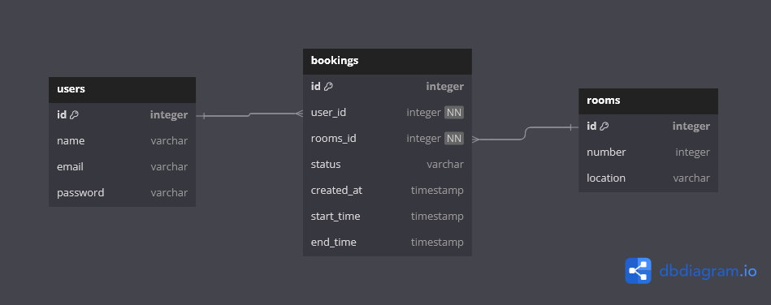
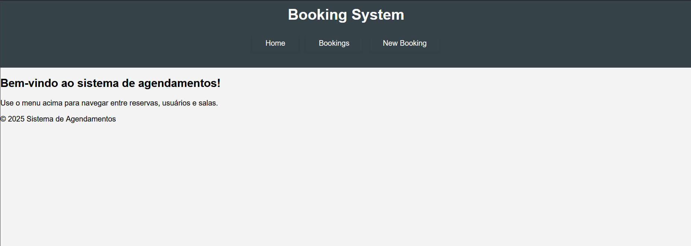
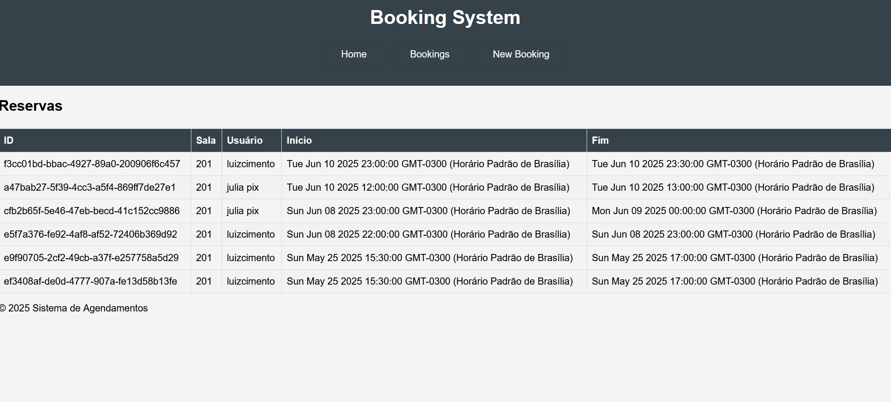
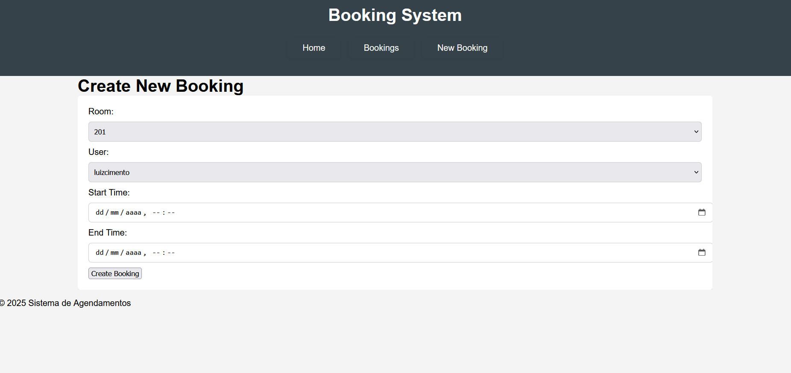

# Web Application Document - Projeto Individual - Módulo 2 - Inteli

**_Os trechos em itálico servem apenas como guia para o preenchimento da seção. Por esse motivo, não devem fazer parte da documentação final._**

## Nome do Projeto

#### Autor do projeto

## Sumário

1. [Introdução](#c1)  
2. [Visão Geral da Aplicação Web](#c2)  
3. [Projeto Técnico da Aplicação Web](#c3)  
4. [Desenvolvimento da Aplicação Web](#c4)  
5. [Referências](#c5)  

 

## 1. Introdução (Semana 01)

O projeto consiste no desenvolvimento de um sistema de agendamentos de salas, onde usuários podem reservar horários disponíveis para uso de ambientes cadastrados. A aplicação será estruturada utilizando Node.js com o framework Express.js, e seguirá o padrão arquitetural MVC (Model-View-Controller), promovendo organização, separação de responsabilidades e escalabilidade.

O sistema será útil em ambientes corporativos, educacionais ou coworkings, permitindo que usuários visualizem, agendem e consultem reservas de salas. A primeira entrega tem como foco estruturar o backend da aplicação, organizar as pastas e arquivos do projeto, modelar o banco de dados e garantir que o servidor esteja rodando corretamente com uma rota funcional.

---

## 2. Visão Geral da Aplicação Web

### 2.1. Personas (Semana 01 - opcional)

*Posicione aqui sua(s) Persona(s) em forma de texto markdown com imagens, ou como imagem de template preenchido. Atualize esta seção ao longo do módulo se necessário.*

### 2.2. User Stories (Semana 01 - opcional)

*Posicione aqui a lista de User Stories levantadas para o projeto. Siga o template de User Stories e utilize a referência USXX para numeração (US01, US02, US03, ...). Indique todas as User Stories mapeadas, mesmo aquelas que não forem implementadas ao longo do projeto. Não se esqueça de explicar o INVEST de 1 User Storie prioritária.*

---

## 3. Projeto da Aplicação Web

### 3.1. Modelagem do banco de dados  (Semana 3)

Foi realizada uma modelagem de banco de dados que atende à lógica central do sistema: usuários reservando salas em horários específicos. A modelagem foi dividida em duas etapas complementares: o modelo relacional (diagrama) e o modelo físico (código SQL).

O modelo relacional apresenta graficamente as entidades principais do sistema (users, rooms, bookings) e os relacionamentos entre elas. Ele permite visualizar como os dados estão conectados, destacando as chaves primárias e estrangeiras que garantem a integridade referencial.

Figura 1: Modelagem relacional do banco de dados. 

 

Fonte: Material produzido pelos autores (2025). 

Já o modelo físico descreve tecnicamente a estrutura do banco de dados por meio de comandos SQL. Ele define os tipos de dados de cada campo, as restrições (como `NOT NULL` e `UNIQUE`) e a ligação entre tabelas através de `FOREIGN KEY`. Os modelos foram pensados para refletir a lógica de agendamento onde um usuário pode fazer várias reservas, ua sala pode ser reservada múltiplas vezes, e cada reserva deve conter a informação do usuário, da sala e do tempo de reserva. O código SQL se encontra em `projeto-individual\scripts\modelo-banco.sql`.

### 3.1.1 BD e Models (Semana 5)

O sistema possui três principais models, localizados na pasta `models`, que representam as entidades centrais do processo de agendamento de salas:

#### 1. User

O model `User` representa os usuários do sistema, responsáveis por realizar reservas. Os principais campos definidos são:

- `id`: Identificador único do usuário (chave primária).
- `name`: Nome do usuário.
- `email`: E-mail do usuário (único).
- `password`: Senha criptografada para autenticação.

Esse model é utilizado para autenticação, cadastro e gerenciamento dos usuários.

#### 2. Room

O model `Room` representa as salas disponíveis para reserva. Seus principais campos são:

- `id`: Identificador único da sala (chave primária).
- `name`: Nome da sala.
- `location`: Localização física da sala.
- `capacity`: Capacidade máxima de pessoas.

Esse model permite o cadastro, consulta e gerenciamento das salas.

#### 3. Booking

O model `Booking` representa as reservas realizadas pelos usuários. Os principais campos são:

- `id`: Identificador único da reserva (chave primária).
- `userId`: Referência ao usuário que fez a reserva (chave estrangeira).
- `roomId`: Referência à sala reservada (chave estrangeira).
- `startTime`: Data e hora de início da reserva.
- `endTime`: Data e hora de término da reserva.

Esse model garante que cada reserva esteja associada a um usuário e a uma sala, além de controlar os horários reservados.

---

Todos os models foram implementados utilizando um ORM (como Sequelize ou Prisma), facilitando a manipulação dos dados e garantindo a integridade referencial entre as tabelas. As validações, restrições e relacionamentos (como associações entre usuários, salas e reservas) estão devidamente configurados para refletir a lógica do sistema.

### 3.2. Arquitetura (Semana 5)

*Posicione aqui o diagrama de arquitetura da sua solução de aplicação web. Atualize sempre que necessário.*

**Instruções para criação do diagrama de arquitetura**  
- **Model**: A camada que lida com a lógica de negócios e interage com o banco de dados.
- **View**: A camada responsável pela interface de usuário.
- **Controller**: A camada que recebe as requisições, processa as ações e atualiza o modelo e a visualização.
  
*Adicione as setas e explicações sobre como os dados fluem entre o Model, Controller e View.*

### 3.3. Wireframes (Semana 03 - opcional)

*Posicione aqui as imagens do wireframe construído para sua solução e, opcionalmente, o link para acesso (mantenha o link sempre público para visualização).*

### 3.4. Guia de estilos (Semana 05 - opcional)

*Descreva aqui orientações gerais para o leitor sobre como utilizar os componentes do guia de estilos de sua solução.*

### 3.5. Protótipo de alta fidelidade (Semana 05 - opcional)

*Posicione aqui algumas imagens demonstrativas de seu protótipo de alta fidelidade e o link para acesso ao protótipo completo (mantenha o link sempre público para visualização).*

### 3.6. WebAPI e endpoints (Semana 05)

A seguir estão descritos os principais endpoints implementados no sistema, organizados por entidade. Cada endpoint segue o padrão RESTful e utiliza os controllers para processar as requisições, interagindo com os models correspondentes.

#### Usuários (`/users`)

- **GET `/users`**  
    Lista todos os usuários cadastrados.

- **GET `/users/:id`**  
    Retorna os dados de um usuário específico pelo seu ID.

- **POST `/users`**  
    Cria um novo usuário.  
    Corpo esperado: `{ name, email, password }`

- **PUT `/users/:id`**  
    Atualiza os dados de um usuário existente.  
    Corpo esperado: `{ name, email, password }`

- **DELETE `/users/:id`**  
    Remove um usuário do sistema.

#### Salas (`/rooms`)

- **GET `/rooms`**  
    Lista todas as salas disponíveis.

- **GET `/rooms/:id`**  
    Retorna os dados de uma sala específica pelo seu ID.

- **POST `/rooms`**  
    Cadastra uma nova sala.  
    Corpo esperado: `{ name, location, capacity }`

- **PUT `/rooms/:id`**  
    Atualiza os dados de uma sala existente.  
    Corpo esperado: `{ name, location, capacity }`

- **DELETE `/rooms/:id`**  
    Remove uma sala do sistema.

#### Reservas (`/bookings`)

- **GET `/bookings`**  
    Lista todas as reservas realizadas.

- **GET `/bookings/:id`**  
    Retorna os dados de uma reserva específica pelo seu ID.

- **POST `/bookings`**  
    Cria uma nova reserva.  
    Corpo esperado: `{ userId, roomId, startTime, endTime }`

- **PUT `/bookings/:id`**  
    Atualiza os dados de uma reserva existente.  
    Corpo esperado: `{ userId, roomId, startTime, endTime }`

- **DELETE `/bookings/:id`**  
    Remove uma reserva do sistema.

#### Autenticação (`/auth`)

- **POST `/auth/login`**  
    Realiza o login do usuário.  
    Corpo esperado: `{ email, password }`  
    Retorna um token de autenticação em caso de sucesso.

---

Todos os endpoints validam os dados recebidos e retornam respostas apropriadas em caso de sucesso ou erro. Para detalhes sobre regras de negócio, validações e exemplos de resposta, consulte os controllers e models correspondentes no código-fonte.

### 3.7 Interface e Navegação (Semana 07)

A interface web foi desenvolvida utilizando EJS para renderização das views. Os principais arquivos de view utilizados são:

* `index.ejs`: Página inicial do sistema.

Figura 2: Pagina inicial. 

 

Fonte: Material produzido pelos autores (2025). 

* `booking.ejs`: Listagem de agendamentos, exibindo ID, número da sala, nome do usuário, início e fim.

Figura 3: Listagem de agendamentos. 

 

Fonte: Material produzido pelos autores (2025). 

* `new.ejs`: Formulário para criação de nova reserva, com seleção de sala (por número) e usuário (por nome).

Figura 4: Formulario de agendamento. 

 

Fonte: Material produzido pelos autores (2025). 

* `header.ejs` e `footer.ejs`: Componentes de cabeçalho e rodapé reutilizáveis.

A navegação permite:

* Visualizar todas as reservas em `/bookings`
* Criar uma nova reserva em `/bookings/new`
* Após criar uma reserva, o usuário é redirecionado automaticamente para a listagem de reservas.

A interface foi estilizada com CSS próprio, tornando a navegação intuitiva e responsiva. O formulário de nova reserva utiliza selects dinâmicos para exibir os nomes dos usuários e os números das salas, facilitando o uso e evitando erros de digitação de IDs.

---

## 4. Desenvolvimento da Aplicação Web (Semana 8)

### 4.1 Demonstração do Sistema Web (Semana 8)

*VIDEO: Insira o link do vídeo demonstrativo nesta seção*
*Descreva e ilustre aqui o desenvolvimento do sistema web completo, explicando brevemente o que foi entregue em termos de código e sistema. Utilize prints de tela para ilustrar.*

### 4.2 Conclusões e Trabalhos Futuros (Semana 8)

*Indique pontos fortes e pontos a melhorar de maneira geral.*
*Relacione também quaisquer outras ideias que você tenha para melhorias futuras.*

## 5. Referências

_Incluir as principais referências de seu projeto, para que o leitor possa consultar caso ele se interessar em aprofundar._ 

---
---